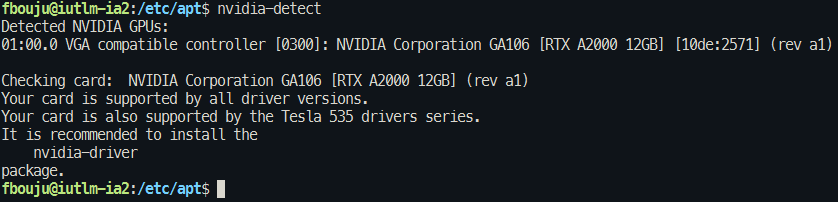
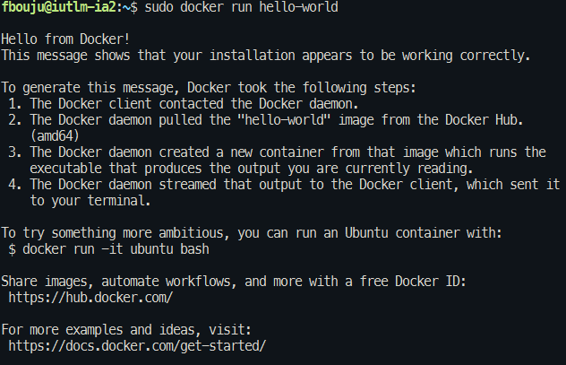
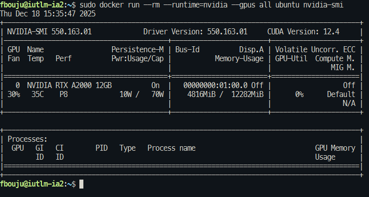

# Système de transcription Speakr + WhisperX-ASR

Speakr transforme vos enregistrements audio en notes organisées, consultables et intelligentes.  
Conçu pour les groupes et les particuliers soucieux de la confidentialité, il fonctionne entièrement sur votre propre infrastructure, garantissant que vos conversations sensibles restent totalement privées.

## Sources

- https://github.com/murtaza-nasir/speakr  
- https://murtaza-nasir.github.io/speakr  
- https://github.com/murtaza-nasir/whisperx-asr-service  
- https://docs.docker.com/engine/install/  
- https://docs.docker.com/engine/cli/proxy/  
- https://docs.docker.com/engine/daemon/proxy/  
- https://docs.nvidia.com/datacenter/cloud-native/container-toolkit/latest/install-guide.html  
- https://wiki.debian.org/NvidiaGraphicsDrivers  
- https://docs.nvidia.com/cuda/cuda-installation-guide-linux/  

---

## Table des matières

1. [Prérequis matériels et logiciels](#prérequis)
2. [Installation des prérequis](#installation)
    * [Pilote NVIDIA](#installation-du-pilote-graphique-nvidia)
    * [Docker Engine](#installation-de-docker-engine)
    * [NVIDIA Docker Runtime](#installation-du-nvidia-docker-runtime)
3. [Installation des services](#installation-et-configuration-de-whisperx-asr)
    * [WhisperX-ASR](#installation-et-configuration-de-whisperx-asr)
    * [Speakr](#installation-et-paramétrage-de-speakr)
4. [Utilisation](#utilisation)

**Si vous avez déja tout les prérequis, passer à l'installation des services directement**

---

## Prérequis

### Hardware

Les besoins en mémoire GPU varient selon la taille du modèle Whisper :

| Modèle Whisper | VRAM requise (avec diarisation) | GPU adaptés |
|---------------|----------------------------------|------------|
| tiny, base    | ~4–5 Go                          | RTX 3060 8GB, RTX 2060, GTX 1660 Ti |
| small         | ~6 Go                            | RTX 3060, RTX 2070, RTX 2080 |
| medium        | ~10 Go                           | RTX 3080, RTX 3060 12GB, RTX 2080 Ti |
| large-v2 / large-v3 | ~14 Go                   | **RTX 3090**, RTX 4090, A6000, A100 |

**Configuration minimale (modèles small / medium)**  
- GPU : NVIDIA RTX 3060 (12 Go de VRAM) ou supérieur  
- CPU : 8 cœurs ou plus  
- RAM : 16 Go  
- Stockage : 50 Go SSD  

**Configuration recommandée (large-v3 avec diarisation)**  
- GPU : NVIDIA RTX 3090 (24 Go de VRAM) ou RTX 4090  
- CPU : 12 cœurs ou plus  
- RAM : 32 Go  
- Stockage : 100 Go SSD

---

### Software

- Un OS capable d’installer et d’exécuter Docker  
  - **Distribution utilisée : Debian 13**
- Docker Engine **>= 20.10**
- Pilote NVIDIA correspondant à votre carte graphique ⚠️
- NVIDIA Docker Runtime (permet à Docker d’accéder au GPU)
- Votre éditeur de fichiers préféré

### Environnement de test utilisé

Les tests ont été réalisés sur un **DELL Precision 3650** avec la configuration suivante :

- Intel Core i5-10700 @ 2.90 GHz  
- 16 Go de DDR4 3200 MHz  
- NVMe 512 Go  
- NVIDIA RTX A2000 12 Go  
- Debian 13
- Accès internet derrière le proxy de l'univ
---

## Installation

> **Disclaimer**  
> Ce tutoriel est basé sur Debian 13 avec une NVIDIA RTX A2000.  
> La machine dispose d’un accès Internet et d’un proxy configuré.  
> Toutes les commandes et procédures sont valables à la date du **02/06/2026**.

Deux scripts sont disponible pour faciliter l'installation de docker et du nvidia-container-toolkit.

```bash
chmod +x scripts/docker_source.sh
chmod +x scripts/install_toolkit.sh

./scripts/docker_source.sh
./scripts/install_toolkit.sh
```

---

## Installation du pilote graphique NVIDIA

**Sources :**  
- https://wiki.debian.org/NvidiaGraphicsDrivers  
- https://docs.nvidia.com/cuda/cuda-installation-guide-linux/  

### 1. Ajout des dépôts `contrib` et `non-free`

Éditer le fichier `/etc/apt/sources.list` et ajouter `contrib` et `non-free` :

```bash
deb http://deb.debian.org/debian/ trixie main non-free-firmware contrib non-free
deb-src http://deb.debian.org/debian/ trixie main non-free-firmware contrib non-free

deb http://security.debian.org/debian-security trixie-security main non-free-firmware contrib non-free
deb-src http://security.debian.org/debian-security trixie-security main non-free-firmware non-free

deb http://deb.debian.org/debian/ trixie-updates main non-free-firmware
deb-src http://deb.debian.org/debian/ trixie-updates main non-free-firmware
```

### 2. Installation et détection du pilote

Installer l’outil de détection :

```bash
sudo apt install nvidia-detect
```

Lancer ensuite :

```bash
nvidia-detect
```

Selon le résultat, installez le pilote recommandé.
Dans mon cas, l’outil recommande le paquet **`nvidia-driver`** :



```bash
sudo apt install nvidia-driver
```

Redémarrer la machine :

```bash
sudo reboot now
```

---

## Installation de Docker Engine

**Sources :**

* [https://docs.docker.com/engine/install/](https://docs.docker.com/engine/install/)
* [https://docs.docker.com/engine/security/rootless/](https://docs.docker.com/engine/security/rootless/)
* [https://docs.docker.com/engine/cli/proxy/](https://docs.docker.com/engine/cli/proxy/)
* [https://docs.docker.com/engine/daemon/proxy/](https://docs.docker.com/engine/daemon/proxy/)

L’installation suivante est réalisée **en mode root** sur Debian.

> Pour une installation rootless :
> [https://docs.docker.com/engine/security/rootless/](https://docs.docker.com/engine/security/rootless/)

### Suppression des anciennes versions

```bash
sudo apt remove $(dpkg --get-selections docker.io docker-compose docker-doc podman-docker containerd runc | cut -f1)
```

### Ajout du dépôt Docker

Un script `docker_source.sh` est disponible dans le dépôt, sinon :

```bash
sudo apt update
sudo apt install ca-certificates curl
sudo install -m 0755 -d /etc/apt/keyrings
sudo curl -fsSL https://download.docker.com/linux/debian/gpg -o /etc/apt/keyrings/docker.asc
sudo chmod a+r /etc/apt/keyrings/docker.asc
```

```bash
sudo tee /etc/apt/sources.list.d/docker.sources <<EOF
Types: deb
URIs: https://download.docker.com/linux/debian
Suites: $(. /etc/os-release && echo "$VERSION_CODENAME")
Components: stable
Signed-By: /etc/apt/keyrings/docker.asc
EOF
```

```bash
sudo apt update
```

### Installation de Docker

```bash
sudo apt install docker-ce docker-ce-cli containerd.io docker-buildx-plugin docker-compose-plugin
```

Démarrer Docker si nécessaire :

```bash
sudo systemctl start docker
```

⚠️ **Attention** : une installation Docker par défaut peut poser des problèmes de sécurité.
Consultez les guides suivants :

* [https://docs.docker.com/engine/install/linux-postinstall/](https://docs.docker.com/engine/install/linux-postinstall/)
* [https://docs.docker.com/engine/security/rootless/](https://docs.docker.com/engine/security/rootless/)

Vérification de l’installation :

```bash
sudo docker run hello-world
```

Resultat:



---

## Installation du NVIDIA Docker Runtime

**Source :**
[https://docs.nvidia.com/datacenter/cloud-native/container-toolkit/latest/install-guide.html](https://docs.nvidia.com/datacenter/cloud-native/container-toolkit/latest/install-guide.html)

Le runtime NVIDIA permet à Docker d’exploiter le GPU, indispensable pour les modèles IA.

### Installation des prérequis

Un script `install_toolkit.sh` est disponible dans le dépôt, sinon :

```bash
sudo apt-get update && sudo apt-get install -y --no-install-recommends \
  curl \
  gnupg2
```

### Ajout des dépôts NVIDIA

```bash
curl -fsSL https://nvidia.github.io/libnvidia-container/gpgkey | sudo gpg --dearmor -o /usr/share/keyrings/nvidia-container-toolkit-keyring.gpg \
  && curl -s -L https://nvidia.github.io/libnvidia-container/stable/deb/nvidia-container-toolkit.list | \
  sed 's#deb https://#deb [signed-by=/usr/share/keyrings/nvidia-container-toolkit-keyring.gpg] https://#g' | \
  sudo tee /etc/apt/sources.list.d/nvidia-container-toolkit.list
```

```bash
sudo apt-get update
```

> **Note**
> La version ci-dessous est valable au **02/06/2026**.

```bash
export NVIDIA_CONTAINER_TOOLKIT_VERSION=1.19.1-1
sudo apt-get install -y \
  nvidia-container-toolkit=${NVIDIA_CONTAINER_TOOLKIT_VERSION} \
  nvidia-container-toolkit-base=${NVIDIA_CONTAINER_TOOLKIT_VERSION} \
  libnvidia-container-tools=${NVIDIA_CONTAINER_TOOLKIT_VERSION} \
  libnvidia-container1=${NVIDIA_CONTAINER_TOOLKIT_VERSION}
```

### Test du GPU dans Docker

```bash
sudo docker run --rm --runtime=nvidia --gpus all ubuntu nvidia-smi
```

Si tout est correct, les informations de votre GPU s’affichent :



**Votre environnement est prêt pour de l’IA self-hostée 🚀**

---

## Installation et configuration de WhisperX-ASR

**Source :**
[https://github.com/murtaza-nasir/whisperx-asr-service](https://github.com/murtaza-nasir/whisperx-asr-service)

> **Disclaimer**
> Le projet est en version **ALPHA**.
> Des bugs, changements de configuration ou comportements instables sont possibles.

Les paramétrages sont dans `whisperx-asr.env`
Prenez le temps de consulter le fichier `docker-compose.yml` ainsi que la documentation officielle.

---

## Configuration Hugging Face

Hugging Face est l’équivalent de GitHub pour les modèles IA.
C’est gratuit

### 1. Création d’un compte

* [https://huggingface.co/join](https://huggingface.co/join)
* Inscription

### 2. Acceptation des conditions des modèles (obligatoire)

Vous devez accepter les conditions pour **les trois modèles suivants** :

1. [https://huggingface.co/pyannote/speaker-diarization-community-1](https://huggingface.co/pyannote/speaker-diarization-community-1)
2. [https://huggingface.co/pyannote/segmentation-3.0](https://huggingface.co/pyannote/segmentation-3.0)
3. [https://huggingface.co/pyannote/speaker-diarization-3.1](https://huggingface.co/pyannote/speaker-diarization-3.1)

Cliquez sur **“Agree and access repository”** pour chacun.

⚠️ Sans cela, vous aurez des erreurs **403 – Access Denied**.

### 3. Génération du token

* [https://huggingface.co/settings/tokens](https://huggingface.co/settings/tokens)
* **New token**
* Nom : `whisperx-diarization` (exemple)
* Permission : **Read**
* Copier le token (`hf_...`)

---

## Paramétrage du conteneur WhisperX

Fichier de configuration : `whisperx-asr.env`

```ini
HF_TOKEN=VOTRE_TOKEN_HUGGING_FACE
DEVICE=cuda
COMPUTE_TYPE=float16
BATCH_SIZE=16
PRELOAD_MODEL=large-v3
MAX_FILE_SIZE_MB=1000
SERVE_MODE=simple
```

### Cas d’un environnement avec proxy

Ajouter dans le `docker-compose.yml` :

```yaml
environment:
  - HTTP_PROXY=http://proxy.XXX:XXX
  - http_proxy=http://proxy.XXX:XXX
  - HTTPS_PROXY=http://proxy.XXX:XXX
  - https_proxy=http://proxy.XXX:XXX
```
---

## Installation et paramétrage de Speakr

**Sources :**

* [https://github.com/murtaza-nasir/speakr](https://github.com/murtaza-nasir/speakr)
* [https://murtaza-nasir.github.io/speakr/](https://murtaza-nasir.github.io/speakr/)

Speakr est l’interface Web qui va utiliser l’API WhisperX que nous venons de mettre en place.
C’est sur cette interface que vous allez pouvoir consulter et interagir avec vos transcriptions.

Les paramétrages sont dans `speakr.env`
Une liste des différents paramètres se trouve ici : [Speakr Vars](./speakr_env_vars.md)

Prenez le temps de consulter le fichier `docker-compose.yml` ainsi que la documentation officielle.

---
## Paramétrage du conteneur Speakr

Fichier de configuration : `speakr.env`
Nous allons nous concentrer sur les principaux paramètres.

---

### Pour le service de transcription local :

```ini
ASR_BASE_URL=http://whisperx-asr:9000
ASR_DIARIZE=true
ASR_RETURN_SPEAKER_EMBEDDINGS=true
```

Cette configuration permet d’utiliser le service `whisperx-asr` que nous venons de mettre en place précédemment.

---

### Pour la génération des résumés, titres, etc. :

```ini
# --- Text Generation Model (for summaries, titles, etc.) ---
TEXT_MODEL_BASE_URL=URL_API_COMPATIBLE_STANDARD_OPEN_AI
TEXT_MODEL_API_KEY=CLE_API
TEXT_MODEL_NAME=NOM_MODELE
```

Un exemple utilisant [https://openrouter.ai](https://openrouter.ai) :

```ini
TEXT_MODEL_BASE_URL=https://openrouter.ai/api/v1
TEXT_MODEL_API_KEY=CLE_API_OPENROUTER
TEXT_MODEL_NAME=openai/gpt-4o-mini
```

**Il est tout à fait possible d’utiliser un modèle de texte local (avec Ollama ou autre).**

---

### Compte administrateur :

```ini
# --- Admin User (created on first run) ---
ADMIN_USERNAME=criut
ADMIN_EMAIL=criut@example.fr
ADMIN_PASSWORD=criut_super_secure
```

**⚠️ Le mot de passe est stocké en clair dans le fichier de configuration ⚠️**

Pour un usage en production, il est recommandé d’utiliser des secrets :

* [https://docs.docker.com/engine/swarm/secrets/](https://docs.docker.com/engine/swarm/secrets/)
* [https://docs.docker.com/compose/how-tos/use-secrets/](https://docs.docker.com/compose/how-tos/use-secrets/)
* [https://blog.stephane-robert.info/docs/conteneurs/moteurs-conteneurs/docker/secrets/](https://blog.stephane-robert.info/docs/conteneurs/moteurs-conteneurs/docker/secrets/)

---

### Démarrage de la stack

```bash
docker compose up -d
```

Les services (Speakr et Whisperx) sont lancé en mode détaché.

---

### Accès à l’interface Web

Vous pouvez enfin accéder à l’interface Web à l’adresse suivante :
👉 **[http://votre-ip/](http://votre-ip/)**

---
